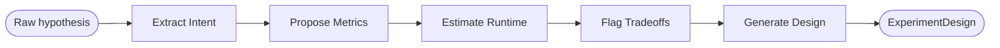
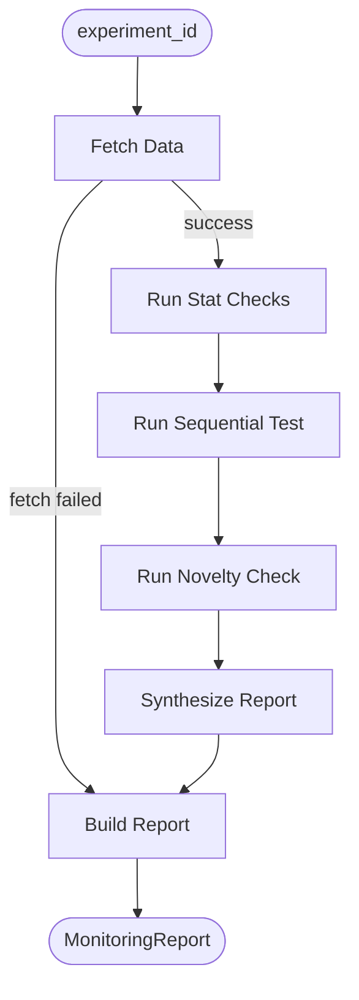
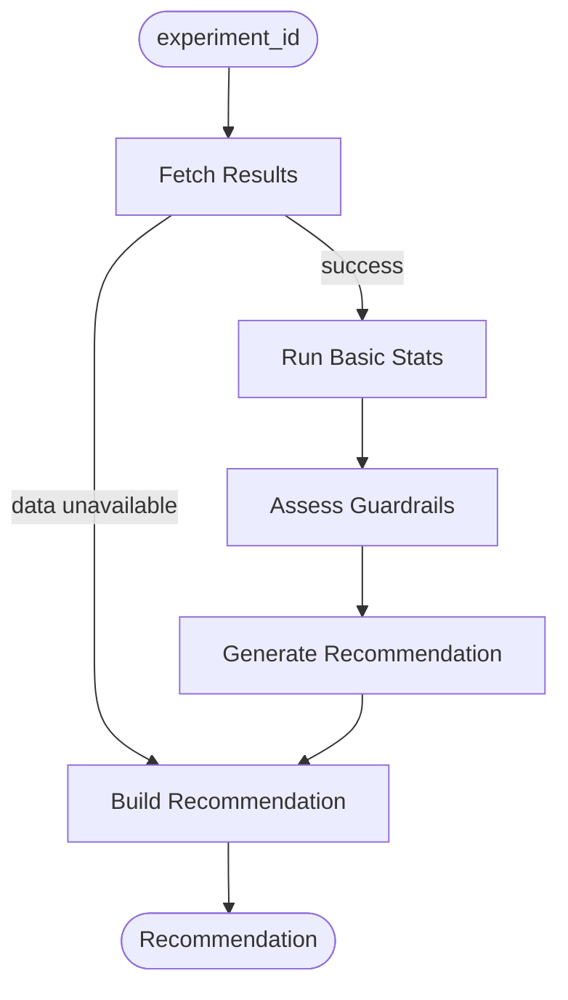

# ExperimentIQ

AI-powered experimentation intelligence platform. Takes a vague hypothesis and returns a structured experiment design. Monitors running experiments for SRM, data quality, sequential testing, and novelty effects. Interprets completed experiments with a ship/iterate/abandon recommendation backed by real statistical evidence.

Built for growth teams at Series A/B companies who run experiments but lack a dedicated internal experimentation platform.

---

## The Problem

Most experiment platforms solve the mechanics well. Randomization, dashboards, p-values. What they do not solve is the judgment layer.

- A PM types "improve onboarding" into a ticket and a DS has to figure out what that actually means as an experiment
- An experiment finishes and someone has to decide whether the guardrail metric degradation is acceptable
- Results come back surprising and nobody knows which segment to cut first

ExperimentIQ handles those parts. It sits on top of GrowthBook and BigQuery, uses Claude Sonnet as the reasoning layer, and produces outputs that are defensible enough to put in a Slack message or a postmortem.

---

## What It Does

**Framing**

Input a rough hypothesis. The system runs it through a five-step LangGraph agent that extracts intent, proposes a primary metric with full measurement definition, recommends guardrails with alert thresholds, estimates runtime based on realistic MDE assumptions, and flags tradeoffs the experimenter should know before launching.

Confidence score tells you how specific the hypothesis was. Low confidence means the agent is asking clarifying questions rather than guessing.

**Monitoring**

For a running experiment, the monitoring agent checks:

- Sample Ratio Mismatch via chi-square test on observed vs expected traffic splits
- Data quality gate covering minimum sample size, data freshness, and minimum runtime
- Sequential testing via O'Brien-Fleming alpha spending to support early stopping decisions
- Novelty detection by comparing early-window lift to overall lift across all days

All checks are wired to real BigQuery data. The agent synthesizes results into a plain-English summary with suggested actions rather than returning raw numbers.

**Interpretation**

For a completed experiment, the interpretation agent computes actual conversion rates per variation, runs Welch's t-test with a 95% confidence interval, checks all guardrail metrics for degradation, and sends the full evidence package to Claude for a final decision.

Output is a structured recommendation: decision (ship/iterate/abandon), confidence score, primary metric summary with actual lift numbers, guardrail summary, follow-up cuts to investigate, and risks of acting on the recommendation.

---

## Stack

| Layer | Technology |
|---|---|
| Data warehouse | Google BigQuery |
| Stats engine | GrowthBook (self-hosted) |
| Data transformation | dbt (dbt-bigquery) |
| Backend | FastAPI |
| AI orchestration | LangGraph + Claude Sonnet (Anthropic) |
| Frontend | Next.js 14 (App Router) |
| Auth | Clerk |
| Local dev | Docker Compose |

---

## How It Works

ExperimentIQ uses three AI agents, each built as a multi-step reasoning pipeline. Each agent breaks a complex judgment task into smaller steps, passes context forward between steps, and calls Claude once per step to reason over that specific piece of the problem. This produces more reliable and auditable output than asking a single LLM call to do everything at once.

**For non-technical readers:** Think of each agent as a specialist analyst. The framing analyst turns a rough idea into a structured plan. The monitoring analyst watches a live experiment and flags anything that looks wrong. The interpretation analyst reads the final results and tells you what to do next, with reasons.

---

### Framing Agent

Takes a rough hypothesis from a PM or DS and turns it into a structured, statistically valid experiment design.

**What it does for your team:** A PM types "improve checkout" and gets back a specific metric, five guardrails with alert thresholds, a runtime estimate with assumptions explained, and a list of tradeoffs to consider before launching. Instead of a DS spending two hours scoping an experiment, this takes 30 seconds and produces a design rigorous enough to review in a sprint planning meeting.



| Step | What Claude does |
|---|---|
| Extract Intent | Identifies the product area, the user behavior being changed, and any ambiguity in the hypothesis |
| Propose Metrics | Recommends exactly one primary metric with a full measurement definition, and multiple guardrail metrics with alert thresholds |
| Estimate Runtime | Estimates experiment duration based on realistic traffic and MDE assumptions, states those assumptions explicitly |
| Flag Tradeoffs | Identifies metric conflicts, novelty risks, accessibility concerns, and statistical caveats specific to this experiment |
| Generate Design | Synthesizes all prior reasoning into a structured JSON output. Retries once on parse failure. Returns confidence score and clarifying questions if hypothesis is too vague |

---

### Monitoring Agent

Watches a running experiment and checks for problems that would make results unreliable or misleading.

**What it does for your team:** A DS or PM opens the experiment dashboard and sees immediately whether the experiment is healthy, whether traffic is splitting correctly, whether there is enough data to trust the results yet, and whether the early lift is real or just users clicking because something is new. No manual SQL queries, no waiting for a weekly sync.



| Step | What it checks |
|---|---|
| Fetch Data | Pulls experiment events, metric observations, and variation counts from BigQuery. Fetches experiment metadata from GrowthBook. Routes directly to a critical report if data is unavailable |
| Run Stat Checks | Sample Ratio Mismatch via chi-square test. Data quality gate covering minimum sample size, data freshness within 24 hours, and minimum runtime of 1 day |
| Run Sequential Test | O'Brien-Fleming alpha spending boundary. Tells you whether you have enough evidence to stop the experiment early or need to keep running |
| Run Novelty Check | Compares early-window lift (first 3 days) to overall lift. A ratio above 1.5 means users are reacting to the novelty of a change, not finding genuine value |
| Synthesize Report | Claude reads all stat check results and writes a plain-English summary with specific suggested actions. Returns health status: healthy, warning, or critical |

---

### Interpretation Agent

Reads a completed experiment and produces a defensible ship/iterate/abandon decision with full statistical evidence.

**What it does for your team:** Instead of a DS manually computing lift, checking guardrails, and writing up a recommendation in a doc, this produces a structured output in under a minute. The reasoning is traceable, the numbers are real, and the output is specific enough to share directly with a product manager or engineering lead as the basis for a launch decision.



| Step | What it does |
|---|---|
| Fetch Results | Pulls primary metric observations from BigQuery. Looks up metric definitions and guardrail metrics. Runs data quality gate. Falls back to iterate with 0% confidence if data is missing |
| Run Basic Stats | Identifies control and treatment variations from the variations table. Computes per-variation conversion rates. Applies CUPED variance reduction if pre-experiment data is available. Runs Welch's t-test with a 95% confidence interval |
| Assess Guardrails | Queries all guardrail metrics from BigQuery. Computes conversion rates per variation per metric. Flags any metric where treatment degraded relative to control |
| Generate Recommendation | Sends the full evidence package to Claude: basic stats, guardrail results, data quality status, and health context. Claude returns a structured JSON with decision, confidence, reasoning, follow-up cuts, and risks. Forces iterate if data quality did not pass |
| Build Recommendation | Assembles the final Recommendation object with a UTC timestamp. Second safety check ensures ship or abandon cannot be returned if data quality failed |

---

### State and Fallback Design

Every agent initializes state with explicit defaults for all fields before the graph runs. Each node returns only the keys it updates and LangGraph merges those partial updates into the running state. A node that encounters an error can return an empty dict without breaking downstream nodes.

Every agent has a defined fallback path:

- Framing returns a design with confidence 0.0 and the parse error surfaced in clarifying questions
- Monitoring returns a critical report with suggested actions explaining what failed
- Interpretation returns an iterate decision with 0% confidence and reasoning explaining why a recommendation could not be made

The UI treats these fallbacks as informative states, not error screens. A critical monitoring report is useful information. A 0% confidence interpretation tells you exactly what data is missing.

---

## Stats Engine

All statistical methods are implemented from scratch using NumPy and SciPy. No experiment libraries.

**CUPED** reduces variance using pre-experiment metric values as covariates. OLS regression computes theta as `cov(x,y) / var(x)`. Adjusted values replace raw outcomes before t-test. Skipped automatically when fewer than 10 users have pre-experiment data or when pre-experiment variance is zero.

**SRM detection** runs a chi-square goodness-of-fit test on observed vs expected variation counts. Flags when p < 0.01. Returns chi-square statistic, p-value, and observed vs expected counts per variation.

**Sequential testing** implements O'Brien-Fleming alpha spending. Information fraction is current sample size divided by estimated final sample size. Boundary is `z_alpha / sqrt(information_fraction)`. Recommends stop_ship, stop_abandon, or continue based on current p-value vs boundary.

**Novelty detection** compares early-window lift (first 3 days) to overall lift across the full experiment. Flags when ratio exceeds 1.5 and both lifts are positive. Returns early lift, overall lift, ratio, and a plain-English message.

**Welch's t-test** with Welch-Satterthwaite degrees of freedom approximation. 95% confidence interval on the difference. Reports absolute lift, relative lift, p-value, and CI bounds.

---

## Project Structure

```
experimentiq/
├── backend/
│   ├── agents/
│   │   ├── framing_agent.py        # Hypothesis to structured experiment design
│   │   ├── monitoring_agent.py     # Running experiment health checks
│   │   └── interpretation_agent.py # Results to ship/iterate/abandon recommendation
│   ├── api/
│   │   ├── experiments.py          # Frame, list, get experiment endpoints
│   │   ├── monitoring.py           # Monitoring report endpoint
│   │   ├── interpretation.py       # Interpretation and recommendation endpoints
│   │   └── health.py               # Health check
│   ├── services/
│   │   ├── bigquery.py             # Async BigQuery client (read-only)
│   │   ├── growthbook.py           # Async GrowthBook REST API client
│   │   └── stats.py                # CUPED, SRM, sequential testing, novelty detection
│   ├── middleware/
│   │   ├── auth.py                 # Clerk JWT validation
│   │   ├── rate_limit.py           # SlowAPI rate limiting
│   │   └── logging.py              # Structured JSON request logging
│   ├── main.py                     # FastAPI app, router registration, middleware
│   └── requirements.txt
├── frontend/
│   ├── app/
│   │   ├── page.tsx                # Dashboard with experiment feed
│   │   ├── experiments/new/        # Framing wizard
│   │   └── experiments/[id]/       # Experiment detail, monitoring, interpretation
│   ├── components/
│   │   ├── ExperimentCard.tsx
│   │   ├── FramingWizard.tsx
│   │   ├── MonitoringPanel.tsx
│   │   └── RecommendationBlock.tsx
│   └── lib/
│       ├── api.ts                  # Typed API client
│       └── auth.ts                 # Clerk session token helper
├── bigquery/
│   ├── schema/
│   │   ├── create_tables.py        # Creates all BigQuery tables
│   │   └── schema_definitions.py   # SchemaField definitions
│   └── load_test_data.py           # Loads 6 realistic experiments with 82K rows
├── dbt/
│   ├── models/
│   │   ├── staging/                # stg_experiment_events, stg_metric_observations
│   │   └── marts/                  # experiment_summary, variation_metrics, experiment_health
│   └── tests/                      # 15 data quality tests
└── docker-compose.yml              # GrowthBook + MongoDB
```

---

## API Endpoints

| Method | Path | Description |
|---|---|---|
| POST | `/api/v1/experiments/frame` | Framing agent: hypothesis to ExperimentDesign |
| GET | `/api/v1/experiments` | List experiments from GrowthBook |
| GET | `/api/v1/experiments/{id}` | Single experiment detail |
| GET | `/api/v1/experiments/{id}/monitor` | Monitoring agent: health report |
| POST | `/api/v1/experiments/{id}/interpret` | Interpretation agent: recommendation |
| GET | `/api/v1/experiments/{id}/recommendation` | Latest recommendation |
| GET | `/health` | Health check |

LLM endpoints are rate limited to 10 requests per minute per user. All endpoints except `/health` and `/docs` require a valid Clerk JWT.

---

## Local Setup

**Prerequisites:** Docker Desktop, Python 3.11+, Node.js 18+, Google Cloud SDK, GCP project with BigQuery enabled, Anthropic API key, Clerk account.

**1. Start GrowthBook**

```bash
docker compose up -d
```

Open `http://localhost:3000`, create an admin account, connect BigQuery as a data source.

**2. Create BigQuery tables**

```bash
cd bigquery/schema
pip install google-cloud-bigquery python-dotenv
export GOOGLE_APPLICATION_CREDENTIALS=/path/to/service-account.json
export BIGQUERY_PROJECT_ID=your-project-id
python create_tables.py
```

**3. Load test data (optional)**

```bash
cd bigquery
python load_test_data.py
```

Loads 6 realistic experiments with 82,355 rows covering completed, running, SRM-affected, and novelty-affected scenarios.

**4. Run dbt models**

```bash
cd dbt
pip install dbt-bigquery
dbt deps
dbt run
dbt test
```

All 15 tests should pass.

**5. Start the backend**

```bash
cd backend
pip install -r requirements.txt
```

Create `backend/.env`:

```
ENVIRONMENT=development
LOG_LEVEL=INFO
ANTHROPIC_API_KEY=your-key
CLERK_JWKS_URL=https://your-clerk-domain/.well-known/jwks.json
CLERK_SECRET_KEY=your-clerk-secret
GROWTHBOOK_API_URL=http://localhost:3100
GROWTHBOOK_API_KEY=your-growthbook-key
BIGQUERY_PROJECT_ID=your-project-id
BIGQUERY_DATASET=experimentation
GOOGLE_APPLICATION_CREDENTIALS=/path/to/service-account.json
```

```bash
uvicorn main:app --reload --port 8000
```

**6. Start the frontend**

```bash
cd frontend
npm install
```

Create `frontend/.env.local`:

```
NEXT_PUBLIC_CLERK_PUBLISHABLE_KEY=your-publishable-key
CLERK_SECRET_KEY=your-secret-key
FASTAPI_BASE_URL=http://localhost:8000
NEXT_PUBLIC_CLERK_SIGN_IN_URL=/sign-in
NEXT_PUBLIC_CLERK_SIGN_UP_URL=/sign-up
NEXT_PUBLIC_CLERK_AFTER_SIGN_IN_URL=/
NEXT_PUBLIC_CLERK_AFTER_SIGN_UP_URL=/
```

```bash
npm run dev -- --port 3001
```

Open `http://localhost:3001`.

---

## Test Experiments

The test data loader creates six experiments that cover different monitoring and interpretation scenarios:

| Experiment | Status | Story |
|---|---|---|
| Checkout Button Color | Completed | Clear ship. 12% to 14.5% conversion lift, guardrails pass, novelty detected |
| Onboarding Email Sequence | Completed | Iterate. 30% to 31% activation, not significant, unsubscribe rate slightly elevated |
| Pricing Page Layout | Running | SRM detected. Control 4800 users vs treatment 3200, randomization broken |
| Search Autocomplete | Running | Continue. Only 3 days of data, sequential test says insufficient information fraction |
| Free Trial Length | Completed | Guardrail failure. Conversion up 9% to 11% but revenue per user down from $95 to $72 |
| Mobile Checkout | Completed | Strong ship. 18% to 26% completion lift on mobile, guardrails healthy |

---

## Security

- All secrets loaded from environment variables via python-dotenv. Nothing hardcoded.
- Service account has BigQuery Data Viewer and BigQuery Job User roles only. No write access.
- Clerk JWT validated on every API request via JWKS endpoint with 300-second cache.
- Next.js API routes proxy all FastAPI calls server-side. Raw experiment data never reaches the browser.
- All user IDs in BigQuery are SHA-256 hashed. No PII in any table.
- LLM calls are stateless. No experiment data stored in conversation history.

---

## Design Decisions

**GrowthBook as the stats engine, not custom.** The goal is the judgment layer, not reinventing randomization and assignment infrastructure. GrowthBook handles that well.

**LangGraph over single LLM calls.** Multi-step agents produce more reliable structured output than prompting for everything in one shot. Each node has a narrow task. State accumulates context across steps.

**Stateless Claude calls.** Every node makes an independent API call with no conversation history. Cleaner audit trail, no context window accumulation, easier to debug when a node fails.

**BigQuery over a lighter database.** The query patterns (partitioned scans by experiment_id, daily aggregations, pre-experiment window queries) are a natural fit. The free tier is sufficient for development and early production use.

**dbt for transformations.** Adds a tested, documented layer between raw events and the application queries. The 15 data quality tests catch issues before they propagate to the agents.
