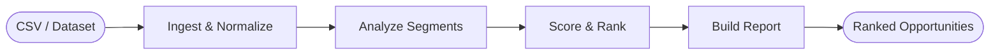

# ExperimentIQ

AI-powered experimentation intelligence platform. Three paths: discover experiment opportunities from behavioral data, interpret completed experiments from raw logs, or connect a live analytics platform for real-time recommendations. Produces defensible, statistically-grounded outputs that are specific enough to share directly with a product manager or engineering lead.

Built for growth teams at Series A/B companies who run experiments but lack a dedicated internal experimentation platform.

---

## The Problem

Most experiment platforms solve the mechanics well. Randomization, dashboards, p-values. What they do not solve is the judgment layer.

- A PM types "improve onboarding" into a ticket and a DS has to figure out what that actually means as an experiment
- An experiment finishes and someone has to decide whether the guardrail metric degradation is acceptable
- Results come back surprising and nobody knows which segment to cut first

ExperimentIQ handles those parts. It sits on top of GrowthBook, uses Claude Sonnet as the reasoning layer, and produces outputs that are defensible enough to put in a Slack message or a postmortem.

---

## What It Does

Three paths from the landing hub at `/select`:

### Path 1 — Opportunity Discovery from Datasets

Upload a behavioral dataset (or pick from four pre-built ones) and get ranked experiment opportunities grounded in your actual data.

- Supported datasets: Google Merchandise Store, Olist E-Commerce, Instacart, Telco Churn
- Upload any CSV — Claude normalizes it automatically, no per-dataset adapter code
- LangGraph agent scores and ranks opportunities by estimated impact
- Each opportunity includes a hypothesis, primary metric, guardrails, and lift estimate
- One click to frame and start the experiment in GrowthBook

### Path 2 — Live Analytics via GA4

Connect Google Analytics 4 via OAuth 2.0 and pull live behavioral data directly.

- Real funnel + segment analysis grounded in your actual traffic
- Graceful fallback to demo data if the GA4 quota is exceeded
- Recommendations start directly in GrowthBook
- Mixpanel and Amplitude support planned

### Path 3 — Post-Experiment Interpretation

Upload raw assignment and event logs. The AI validates integrity, computes all statistics, and tells the full story.

- Upload two CSVs: assignment log (user_id, variant, timestamp) + event log (user_id, event_name, timestamp, revenue)
- SRM detection, novelty detection, significance testing, revenue analysis
- Full narrative interpretation with key evidence, risks, and follow-up cuts
- Ship / Don't Ship / Run Longer verdict with confidence score

---

## Stack

| Layer | Technology |
|---|---|
| Backend | FastAPI |
| AI orchestration | LangGraph + Claude Sonnet (Anthropic) |
| Stats engine | NumPy + SciPy (manual implementations) |
| Experiment platform | GrowthBook (self-hosted via Docker) |
| Frontend | Next.js 14 (App Router) |
| Auth | Clerk |
| Analytics integration | Google Analytics 4 (OAuth 2.0) |
| Local dev | Docker Compose |

---

## How It Works

### Opportunity Discovery Agent

Takes a behavioral dataset and returns ranked experiment opportunities backed by actual data signals.



| Step | What it does |
|---|---|
| Ingest & Normalize | Claude reads any CSV and extracts behavioral signals — funnel drop-offs, segment performance gaps, revenue patterns |
| Analyze Segments | Identifies the highest-leverage areas: which pages, devices, user cohorts, or product categories have the biggest gaps |
| Score & Rank | Each opportunity is scored by estimated impact, implementation difficulty, and signal strength |
| Build Report | Returns structured opportunities with hypothesis, primary metric, guardrail recommendations, and lift estimates |

---

### Post-Experiment Statistical Pipeline

Runs the full statistical analysis on raw logs before passing results to Claude for interpretation.

**SRM Detection** — chi-square goodness-of-fit test on observed vs expected traffic splits. Flags when p < 0.01. Signals randomization infrastructure problems that would make all downstream results unreliable.

**Novelty Detection** — splits the experiment window at the midpoint and computes lift in each half. A ratio above 1.5 where both halves are positive means users are reacting to novelty, not finding genuine value.

**Conversion Rate Significance** — two-proportion z-test with pooled standard error. Computes z-statistic, two-tailed p-value, and 95% confidence interval on relative lift.

**Revenue Per User** — Welch's t-test (unequal variance) for continuous revenue metrics. Correct for real experiment data where variance is almost never equal between variants.

**Guardrail Metrics** — each guardrail event type gets its own z-test. Any guardrail that degrades significantly is flagged and factored into the final verdict.

---

### Interpretation Layer

After statistics are computed, Claude produces the full interpretation.

- Verdict: **Ship**, **Don't Ship**, or **Run Longer**
- Confidence score tied to statistical evidence quality
- Narrative: what moved, what didn't, and why it matters
- Key evidence: the 3–5 most important signals from the data
- Risks: what could go wrong if you act on this recommendation
- Follow-up: next experiments or cuts to investigate

---

### GA4 Integration

OAuth 2.0 flow with Google. The callback route is a public path (no Clerk auth required) to avoid authentication chain latency. The backend exchanges the authorization code for tokens, stores them in-memory keyed by Clerk user ID, and uses the GA4 Data API to pull real funnel and segment data.

Rate limit fallback: the demo GA4 property (213025502) exhausts its quota quickly under shared use. When the API returns 429, the backend falls back to `ingest_demo()` automatically without surfacing an error to the user.

---

## Project Structure

```
experimentiq/
├── backend/
│   ├── agents/
│   │   ├── opportunity_agent.py        # Dataset → ranked experiment opportunities
│   │   ├── framing_agent.py            # Hypothesis → structured experiment design
│   │   ├── monitoring_agent.py         # Running experiment health checks
│   │   └── interpretation_agent.py    # Results → ship/iterate/abandon recommendation
│   ├── api/
│   │   ├── datasets.py                 # Dataset upload + opportunity discovery endpoints
│   │   ├── analytics.py                # GA4 OAuth + live data analysis
│   │   ├── experiment_interpret.py     # Raw log upload → stats → AI verdict
│   │   ├── experiments.py             # Frame, list, get experiment endpoints
│   │   ├── monitoring.py              # Monitoring report endpoint
│   │   ├── interpretation.py          # Interpretation and recommendation endpoints
│   │   └── health.py                  # Health check
│   ├── services/
│   │   ├── experiment_stats.py         # Full statistical pipeline (SRM, novelty, z-test, t-test)
│   │   ├── experiment_interpreter.py  # Claude interpretation layer
│   │   ├── analytics_ingestion.py     # GA4 data normalization
│   │   ├── growthbook.py              # GrowthBook REST API client
│   │   └── stats.py                   # CUPED, sequential testing, shared stat utilities
│   ├── middleware/
│   │   ├── auth.py                    # Clerk JWT validation (OAuth callback is public)
│   │   ├── rate_limit.py              # SlowAPI rate limiting
│   │   └── logging.py                 # Structured JSON request logging
│   ├── main.py                        # FastAPI app, router registration, middleware
│   └── requirements.txt
├── frontend/
│   ├── app/
│   │   ├── select/page.tsx            # Three-path hub
│   │   ├── datasets/page.tsx          # Dataset selection + upload
│   │   ├── analytics/page.tsx         # GA4 connection + live analysis
│   │   ├── interpret/page.tsx         # Raw log upload + results display
│   │   ├── experiments/new/           # Framing wizard
│   │   └── experiments/[id]/          # Experiment detail, monitoring, interpretation
│   ├── app/api/
│   │   ├── experiments/interpret/     # Next.js proxy to FastAPI interpret endpoint
│   │   ├── auth/callback/google/      # OAuth callback handler (no Clerk auth)
│   │   └── analytics/                 # GA4 connection status + data endpoints
│   └── lib/
│       ├── api.ts                     # Typed API client
│       └── auth.ts                    # Clerk session token helper
├── docker-compose.yml                 # GrowthBook + MongoDB
├── ubereats_assignment.csv            # Demo: social proof experiment (Ship verdict)
├── ubereats_events.csv
├── linkedin_assignment.csv            # Demo: AI connection request experiment (Don't Ship verdict)
└── linkedin_events.csv
```

---

## API Endpoints

| Method | Path | Description |
|---|---|---|
| POST | `/api/v1/datasets/analyze` | Upload CSV → ranked experiment opportunities |
| GET | `/api/v1/auth/google/authorize` | Start GA4 OAuth flow |
| POST | `/api/v1/auth/google/callback` | Exchange OAuth code for tokens (public route) |
| GET | `/api/v1/auth/google/status` | Check GA4 connection status |
| POST | `/api/v1/analytics/analyze` | Run opportunity discovery on live GA4 data |
| POST | `/api/v1/experiments/interpret/` | Upload raw logs → stats → AI verdict |
| POST | `/api/v1/experiments/frame` | Framing agent: hypothesis to ExperimentDesign |
| GET | `/api/v1/experiments` | List experiments from GrowthBook |
| GET | `/api/v1/experiments/{id}` | Single experiment detail |
| GET | `/api/v1/experiments/{id}/monitor` | Monitoring agent: health report |
| POST | `/api/v1/experiments/{id}/interpret` | Interpretation agent: recommendation |
| GET | `/health` | Health check |

LLM endpoints are rate limited to 10 requests per minute per user. All endpoints except `/health`, `/docs`, and the OAuth callback require a valid Clerk JWT.

---

## Demo CSV Files

Two realistic experiment datasets are included at the project root for testing the interpretation feature end-to-end.

**Social Proof Experiment** (`ubereats_assignment.csv` + `ubereats_events.csv`)

10,100 users across control and treatment. Treatment shows +23.1% lift on the primary conversion event (18.0% → 22.2%). All guardrails pass. Expected verdict: **Ship**.

**Engagement Feature Experiment** (`linkedin_assignment.csv` + `linkedin_events.csv`)

9,700 users. Treatment shows +19% on the primary engagement event but a downstream removal metric increases 162% and a spam signal increases 214%. Expected verdict: **Don't Ship** — the primary metric improves but guardrails reveal severe downstream harm.

These two examples are intentionally contrasting: one is a clean win, one is a case where acting on the primary metric alone would lead to the wrong decision. They demonstrate that the system handles nuanced real-world outcomes, not just textbook results.

---

## Local Setup

**Prerequisites:** Python 3.11+, Node.js 18+, Anthropic API key, Clerk account, Google Cloud project with GA4 access (for Path 2). Docker is installed automatically — see below.

**1. Run the setup script**

This checks for Docker, Node.js, and Python and installs anything that's missing. Run it once from the project root before anything else.

```bash
chmod +x setup.sh && ./setup.sh
```

On macOS it installs Docker Desktop via Homebrew if needed. On Linux it uses apt or yum. On Windows it prints a download link. Safe to run multiple times — it skips anything already installed.

Alternatively, `npm install` inside the `frontend/` folder also runs an automatic Docker check as a `postinstall` hook, and for Python you can run:

```bash
python scripts/check_deps.py
```

before `pip install` to verify Docker and your Python version upfront.

**2. Start GrowthBook**

```bash
docker compose up -d
```

Open `http://localhost:3000`, create an admin account.

**3. Start the backend**

```bash
cd backend
pip install -r requirements.txt
```

Create `backend/.env`:

```
ENVIRONMENT=development
ANTHROPIC_API_KEY=your-key

# Clerk — CLERK_ISSUER_URL is your Clerk Frontend API URL (e.g. https://xxxx.clerk.accounts.dev)
CLERK_JWKS_URL=https://your-clerk-domain/.well-known/jwks.json
CLERK_ISSUER_URL=https://your-clerk-domain
CLERK_SECRET_KEY=your-clerk-secret

# GrowthBook
GROWTHBOOK_API_URL=http://localhost:3100
GROWTHBOOK_API_KEY=your-growthbook-key

# Google OAuth (GA4)
GOOGLE_OAUTH_CLIENT_ID=your-google-oauth-client-id
GOOGLE_OAUTH_CLIENT_SECRET=your-google-oauth-client-secret
GOOGLE_OAUTH_REDIRECT_URI=http://localhost:3001/api/auth/callback/google

# OAuth token encryption — generate with:
# python -c "from cryptography.fernet import Fernet; print(Fernet.generate_key().decode())"
OAUTH_ENCRYPTION_KEY=your-fernet-key

# CORS — comma-separated list of allowed origins (no wildcards)
ALLOWED_ORIGINS=http://localhost:3001
```

Create a `.env` file at the project root for Docker Compose (MongoDB credentials):

```
MONGO_USERNAME=your-mongo-username
MONGO_PASSWORD=your-strong-mongo-password
```

```bash
uvicorn main:app --reload --port 8000
```

**4. Start the frontend**

```bash
cd frontend
npm install
```

Create `frontend/.env.local`:

```
NEXT_PUBLIC_CLERK_PUBLISHABLE_KEY=your-publishable-key
CLERK_SECRET_KEY=your-clerk-secret-key
FASTAPI_BASE_URL=http://localhost:8000
NEXT_PUBLIC_CLERK_SIGN_IN_URL=/sign-in
NEXT_PUBLIC_CLERK_SIGN_UP_URL=/sign-up
NEXT_PUBLIC_CLERK_AFTER_SIGN_IN_URL=/select
NEXT_PUBLIC_CLERK_AFTER_SIGN_UP_URL=/select
```

```bash
npm run dev -- --port 3001
```

Open `http://localhost:3001`. After sign-in you land on `/select` to choose a path.

---

## Testing the Interpretation Feature

The fastest way to test end-to-end with realistic data:

1. Go to `/interpret`
2. Upload `ubereats_assignment.csv` as the assignment file
3. Upload `ubereats_events.csv` as the events file
4. Set a hypothesis describing what the treatment was testing
5. Set the target event name matching the primary conversion event in the file
6. Submit — expect a **Ship** verdict at ~95% confidence

Then repeat with the second pair of files. Expect a **Don't Ship** verdict despite the primary metric improving — the guardrail signals reveal downstream harm that makes shipping the wrong call.

The system works the same way with your own CSV files. Any assignment log (columns: `user_id`, `variant`, `timestamp`) and event log (columns: `user_id`, `event_name`, `timestamp`, optionally `revenue`) will be accepted.

---

## Statistical Methods

All statistical methods are implemented from scratch using NumPy and SciPy.

**Two-proportion z-test** for conversion rate comparisons. Uses pooled standard error: `p_pool = (conv_ctrl + conv_trt) / (users_ctrl + users_trt)`, `SE = sqrt(p_pool * (1 - p_pool) * (1/n_ctrl + 1/n_trt))`. Two-tailed p-value via `scipy.stats.norm.cdf`. 95% CI via normal approximation on relative lift.

**Welch's t-test** (`scipy.stats.ttest_ind(equal_var=False)`) for continuous revenue metrics. Correct for real experiment data where variance between variants is almost never equal.

**SRM detection** — chi-square goodness-of-fit (`scipy.stats.chisquare`) on observed vs expected variation counts given the target traffic split. Flags when p < 0.01.

**Novelty detection** — splits experiment window at midpoint. Computes conversion rate lift in each half. Flags when the early-window lift is more than 1.5× the full-window lift and both are positive.

**CUPED** (in the framing/monitoring agents) — OLS regression using pre-experiment metric values as covariates to reduce variance. `theta = cov(pre, post) / var(pre)`. Skipped when fewer than 10 users have pre-experiment data.

**Sequential testing** (in the monitoring agent) — O'Brien-Fleming alpha spending boundary. `boundary = z_alpha / sqrt(information_fraction)`. Recommends stop_ship, stop_abandon, or continue.

---

## Security

- All secrets loaded from environment variables. Nothing hardcoded.
- Clerk JWT validated on every API request via JWKS endpoint.
- The GA4 OAuth callback route is explicitly whitelisted as a public path. All other non-health routes require authentication.
- OAuth tokens stored in-memory server-side, keyed by Clerk user ID. Not persisted to disk or a database.
- Next.js API routes proxy all FastAPI calls server-side. Raw data never reaches the browser directly.
- LLM calls are stateless. No experiment data stored in conversation history between calls.

---

## Design Decisions

**Universal CSV normalization via Claude instead of per-dataset adapters.** Rather than writing a separate ingestion adapter for every dataset format, Claude reads the raw CSV and extracts behavioral signals directly. This handles arbitrary column names, mixed formats, and novel datasets without any code changes.

**LangGraph over single LLM calls.** Multi-step agents produce more reliable structured output than prompting for everything in one shot. Each node has a narrow task and LangGraph merges partial state updates. Undeclared keys in the TypedDict are silently dropped by LangGraph — all state keys must be declared explicitly.

**Stateless Claude calls.** Every node makes an independent API call with no conversation history. Cleaner audit trail, no context window accumulation, easier to debug when a node fails.

**Public OAuth callback.** Making the GA4 callback route bypass Clerk auth eliminates one async hop in the OAuth flow. The callback only handles a temporary authorization code — there is no meaningful security benefit to requiring a Clerk JWT at this step.

**Graceful 429 fallback for GA4.** The demo GA4 property quota is exhausted quickly under shared use. Falling back to static demo data rather than surfacing an error means the feature is always demonstrable regardless of quota state.

**Ship/Don't Ship/Run Longer as the output primitive.** These three verdicts map directly to the actual decision a PM or DS has to make. They are more actionable than a p-value and more defensible than a qualitative recommendation without numbers behind it.
